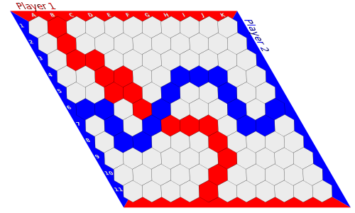
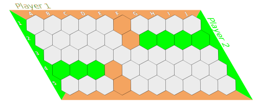
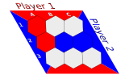
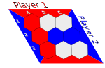
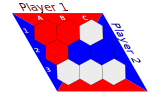
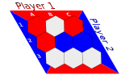
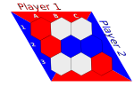
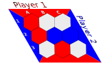

De opgave van dit jaar bestaat uit het implementeren van het bordspel
Con-tac-tix. In dit document geven we een overzicht van de basis functionaliteit
van dit spel. Verder geven we een overzicht van de vereisten waar je project aan
moet voldoen. Studenten worden aangemoedigd om zelf nog extra gewenste
functionaliteit te voorzien.

# Con-tac-tix

Con-tac-tix is een bordspel dat gespeeld wordt op een ruitvormig bord van
hexagonale tegels. De dimensie kan verschillen, maar de meest voorkomende
variant wordt gespeeld op een bord van 11 × 11. Het spel wordt gespeeld door twee
spelers die beschikken over een set van rode en blauwe tegels. De linker en
rechterzijde van het bord zijn van de blauwe speler. De boven en onderzijde van
het bord zijn van de rode speler. De tegels in de hoeken behoren tot beide
speler. Spelers plaatsen om de beurt één tegel (in hun kleur) op het bord, op een plaats waar nog geen tegel is. Het doel van beide spelers is om een pad
te vormen tussen de twee zijden van diens kleur. Het pad mag eender welke vorm
aannemen zolang elk deel in de schakel een ander deel van het pad raakt door een
van de zijde van het hexagoon. Een voorbeeld van een winnende configuratie voor
de blauwe speler is hieronder weergegeven.



# API van het spel

Het spel moet geïmplementeerd worden als een input-output programma welke een
bepaalde staat van het bord als input neemt, de beste zet bedenkt en
uiteindelijk de nieuwe configuratie van het bord wegschrijft naar de output.

## Bord voorstelling

Borden worden voorgesteld door een newlines (`\n`) gescheiden lijst
van, in willekeurige volgorde:

- De grootte van het bord: "`size:`" gevolgd door het aantal kolommen, gevolgd
  door "`*`", gevolgd door het aantal rijen;

- De speler die aan de beurt is: "`turn:`" gevolgd door de kleur van de speler
  die aan zet is;
- De kleuren van de spelers: "`orientation:`" gevolgd door de kleur van de
  speler die van boven naar onder speelt, gevolgd door "`*`", gevolgd door het
  de speler die van links naar rechts speelt;
- De status van het spel: "`state`" gevolgd door:
  - "`undecided`" als het spel nog niet beslist is,
  - "`won by colour`" Als het spel gewonnen is door de speler met kleur `colour`
    (bijvoorbeeld "`won by red`");
- De tegels in het spel: `tiles:` gevolgd door het aantal tegels in het spel,
  gevolgd door een door nieuwe lijn (`\n`) gevolgd door een door newlines (`\n`) gescheiden opsomming
  van tegels:
  - Elke tegel is van de vorm `(POS) -> colour`,
  - `POS`: De positie van de tegel geschreven als de kolomnaam (letter) gevolgd
    door het rijnummer.
    - Kolomnamen zijn in volgorde: A,B,C,...,Z
    - Rijnamen zijn in volgorde: 1,2,3,...,10,11,...
  - Voorbeelden: `(A1) -> red` , `(B4) -> blue`

Het spelbord van hierboven kan dus worden weergegeven als:

```yaml
size: 11 * 11
turn: red
tiles: 32
    (B1) -> red
    (A6) -> blue
    (D4) -> red
    (B2) -> red
    (B3) -> red
    (B8) -> blue
    (B6) -> blue
    (E6) -> blue
    (C4) -> red
    (C8) -> blue
    (B7) -> blue
    (D7) -> blue
    (C5) -> red
    (D5) -> red
    (C3) -> red
    (D6) -> red
    (E7) -> red
    (G9) -> red
    (F5) -> blue
    (I7) -> blue
    (H4) -> blue
    (E11) -> red
    (K6) -> blue
    (F7) -> red
    (I6) -> blue
    (G4) -> blue
    (G7) -> red
    (F10) -> red
    (G8) -> red
    (J7) -> blue
    (I4) -> blue
    (I5) -> blue
state: won by blue
orientation: red * blue
```

Het volgende bord



wordt onder andere als volgt weergegeven:

```yaml
state: undecided
tiles: 11
    (A4) -> lime
    (C4) -> lime
    (D4) -> SandyBrown
    (B4) -> lime
    (F1) -> SandyBrown
    (F2) -> SandyBrown
    (H2) -> lime
    (D5) -> SandyBrown
    (J2) -> lime
    (G2) -> lime
    (I2) -> lime
turn: lime
size: 10 * 5
orientation: SandyBrown * lime
```

Je mag ervan uitgaan dat de kleuren voor spelers geldige
[web kleur namen](https://drafts.csswg.org/css-color/#named-colors) zijn. Spaties mogen genegeerd worden tijdens het parsen. Je moet een foutboodschap
uitschrijven en stoppen met een exit-code die verschilt van nul als de invoer
niet geldig is. Een bord kan ongeldig zijn als:

- Het aantal tegels dat aangekondigd is, niet overeenstemt met het effectieve
  aantal tegels
- De kleuren van de tegels niet overeenkomen met die in `orientation`
- De kleuren van de tegels niet matchen met `[a-zA-Z0-9]+`
- de `size` niet als getallen gescheiden door `*` is ingegeven
- ...

Je moet **niet** controleren of:

- het `state` veld correct is, je zult alleen maar borden als invoer krijgen die
  `undecided` zijn
- het aantal tegels dat gelegd eerlijk is verdeeld, je kunt borden krijgen waar
  een speler al opvallend meer tegels heeft gelegd dan de andere.

## Basis werking

Als het programma wordt uitgevoerd zonder argumenten, zoek je
naar de beste volgende zet. Vervolgens schrijf je die weg naar standaard
uitvoer. Er wordt minstens verwacht dat je AI, als die in één zet kan winnen,
zeker wint.

### Voorbeeld

Een voorbeeld van een configuratie waarbij je programma de winnende zet moet
teruggeven.

#### Invoer



```yaml
orientation: red * blue
tiles: 4
    (A2) -> red
    (B2) -> blue
    (A1) -> red
    (C2) -> blue
size: 3 * 3
turn: red
state: undecided
```

#### Output



```bash
cat invoerFile | swipl -f none -t halt -g main -q main.pl
```

```yaml
state: won by red
turn: blue
tiles: 5
    (C2) -> blue
    (A1) -> red
    (A2) -> red
    (A3) -> red
    (B2) -> blue
size: 3 * 3
orientation: red * blue
```

## Testen

Als je programma met een extra argument `TEST` wordt uitgevoerd, is de uitvoer
een lijst van alle mogelijke volgende borden gescheiden door regel die alleen
maar "`~`" bevat.

### Voorbeeld:

#### Invoer


```yaml
orientation: red * blue
tiles: 4
    (A2) -> red
    (B2) -> blue
    (A1) -> red
    (C2) -> blue
size: 3 * 3
turn: red
state: undecided
```

#### Output

  
 

```bash
cat invoerFile | swipl -f none -t halt -g main -q main.pl TEST
```

```yaml
state: won by red
turn: blue
tiles: 5
    (C2) -> blue
    (A1) -> red
    (A2) -> red
    (A3) -> red
    (B2) -> blue
size: 3 * 3
orientation: red * blue
~
tiles: 5
    (A2) -> red
    (A1) -> red
    (B2) -> blue
    (B1) -> red
    (C2) -> blue
state: undecided
size: 3 * 3
orientation: red * blue
turn: blue
~
size: 3 * 3
tiles: 5
    (B2) -> blue
    (A1) -> red
    (A2) -> red
    (C1) -> red
    (C2) -> blue
orientation: red * blue
turn: blue
state: undecided
~
tiles: 5
    (A1) -> red
    (A2) -> red
    (B2) -> blue
    (C2) -> blue
    (C3) -> red
size: 3 * 3
turn: blue
state: undecided
orientation: red * blue
~
tiles: 5
    (A1) -> red
    (A2) -> red
    (B2) -> blue
    (B3) -> red
    (C2) -> blue
state: undecided
orientation: red * blue
size: 3 * 3
turn: blue
```

## SVG-voorstelling

Als je programma met `SVG` wordt uitgevoerd print je een geldige SVG van het bord. Als er meerdere borden
zijn, plaats je ze onder elkaar.

Tips:

- Bekijk de SVG's die in deze opgave gebruikt zijn (je mag er van afwijken)
- Met SVG groepen en translatie (`<g transform="translate(...)">`) kun je
  groepen van SVG-elementen verplaatsen.

Volgende commando's dienen een gepaste SVG terug te geven.

```bash
cat invoerFile | swipl -f none -t halt -g main -q main.pl SVG
cat invoerFile | swipl -f none -t halt -g main -q main.pl TEST SVG
cat inputFile | swipl -f none -t halt -g main -q main.pl SVG TEST
```

# Niet functionele eisen

Naast de basisfunctionaliteit zijn er enkele niet functionele eisen waar je
project aan moet voldoen. Deze niet functionele eisen zijn even belangrijk als
de functionele eisen van het project.

- De code moet **goed gedocumenteerd** zijn, er moet commentaar geschreven zijn
  bij elke (logische) regel.
- Je code moet **getest** zijn, dit wil zeggen dat je voor elk van de bewegingen
  zelf een test schrijft, zodat je zeker bent dat de basis functionaliteit
  werkt.
- Je code moet opgesplitst worden in logische modules.
- Schrijf je code zo dat algemene functionaliteit makkelijk kan hergebruikt
  worden.
- Je Con-tac-tix computer moet gebaseerd zijn op een variant van **min-max
  bomen** (alpha-bèta snoeien). We laten uitzonderingen toe op deze regel in
  onderling overleg met de assistent van het vak.
- Het spel moet testbaar zijn met de voorziene code op Ufora (volgt later).
  Projecten die niet testbaar zijn met deze automatische test zullen **automatisch**
  **als onontvankelijk verklaard** worden.

# Verslag

We verwachten een bondig verslag die de algemene oplossingsstrategie van je spel
beschrijft. Voeg aan je verslag je code toe met lijnnummers, zodat je in de
uitleg van je verslag kan verwijzen naar de relevante delen van je code. Je bent
zelf vrij hoe je dit verslag organiseert, maar we verwachten op zijn minst de
volgende onderdelen:

- Inleiding
- Interne bord voorstelling
- Algoritme (met kort voorbeeld)
- Conclusie (wat heb je gerealiseerd en wat beter kan)

# Checklist

Je project is veel meer dan alleen maar de code van de AI, hieronder een
checklist om na te gaan of je alle onderdelen hebt afgewerkt.

- [ ] Con-tac-tix implementatie
- [ ] Code documentatie
- [ ] Testcode (bijvoorbeeld PlUnit)
- [ ] Test functionaliteit (het TEST argument)
- [ ] Verslag
- [ ] Alles pushen naar `master` op
      `git@subgit.ugent.be:2019-2020/LP/{studentnr}`

# Indienen

## Bestandenstructuur

Je project moet volgende structuur hebben:

- `src/` bevat alle broncode (inclusief `main.pl`).
- `tests/` alle testcode.
- `extra/verslag.pdf` bevat de elektronische versie van je verslag. In deze map
  kun je ook eventueel extra bijlagen plaatsen.

Je directory structuur ziet er dus ongeveer zo uit:

```
|
|-- extra/
|   `-- verslag.pdf
|-- src/
|   |-- main.pl
|   `-- je broncode
`-- tests/
    `-- je testcode
```

## Compileren

De code zal bij het indienen getest worden met de opdracht
`swipl -s src/main.pl` door SubGIT met SWI prolog versie 8.0.3. Op UFora zal de
Dockerfile en bijhorende bronbestanden staan die SubGIT gebruikt om je code te
compileren en minimale testen op uit te voeren. Je kunt deze Docker ook
onmiddellijk van Dockerhub halen met volgende commando's:

```bash
docker pull beardhatcode/lp-project-2019-2020:latest
docker run -it --rm --mount type=bind,source={PAD},destination=/submission,readonly beardhatcode/lp-project-2019-2020:latest
```

Waarbij `{PAD}` vervangen moet worden met het absolute pad naar je project.

## SubGIT

Het indienen gebeurt via het [SubGIT](https://subgit.ugent.be/) platform. Als je
hier nog geen account op hebt, dien je deze aan te maken.

### Repository afhalen

```bash
git clone git@subgit.ugent.be:2019-2020/LP/{studentnr} projectConTacTix
```

### Opgave als upstream instellen

Je kunt de opgave en boilerplate voor het project afhalen door de opgave
repository als upstream met volgende commando's in de `projectConTacTix` map:

```bash
git remote add upstream git@subgit.UGent.be:2019-2020/LP-assignment
git pull upstream master
```

### Feedback

Als je pusht naar SubGIT, zul je in je terminal te zien krijgen of je code
voldoet aan de minimumvereisten. In dat geval krijg je bij het pushen de melding
dat het pushen geslaagd is:

```
remote: Acceptable submission
```

Je kunt geen code pushen naar de `master` branch als die niet compileert of niet
aan de minimale IO vereisten voldoet. Je kunt echter wel pushen naar andere
branches en daar zal je push wel aanvaard worden.

### `master` branch

De `master` branch op SUBGit stelt jou ingave voor. Je kunt voor de deadline
zoveel pushen als je wilt. Zorg ervoor dat je voor de deadline zeker je finale
versie naar de **`master`** branch hebt gepushed.

### Controleren of je zeker goed hebt ingediend

Je kunt je indiening bekijken door je repository nog eens te klonen in een
andere map

```
cd eenAndereMap
git clone git@subgit.ugent.be:2019-2020/LP/{studentnr} projectLPControle
```

## Deadlines

Zorg ervoor dat je eerste tussentijdse versie hebt gepusht hebt naar een branch
op SubGIT voor **2020-03-26 om 13:37:42**. De versie die je hier upload zal niet
bekeken worden, we vragen je dit te doen, zodat we er zeker van zijn dat
iedereen kan indienen. Als je niets pusht voor deze deadline, verlies je al je
punten voor het project.

Na **2020-05-21 om 13:37:42** kun je ook geen wijzigingen meer aanbrengen aan je
SubGIT repo. De code in de `src` map, de testen in de `test` map en het verslag
in `extra/verslag.pdf` zijn je finale indiening. Voor de deadline kun je zo veel
pushen naar master als je wilt.

# Algemene richtlijnen

- Schrijf efficiënte code, maar ga niet over-optimaliseren: **geef de voorkeur
  aan elegante, goed leesbare code** Kies zinvolle namen voor predicaten en
  variabelen en voorzie voldoende commentaar.
- Op Ufora staat een Dockerfile waarmee je een Linux container kunt bouwen die
  jou code compileert en minimale testen uitvoert. Als alle testen slagen zal
  dit programma `AANVAAARD` uitschrijven als laatste regel en stoppen met exit
  code 0. Code die hier niet aan voldoet zal niet aanvaard worden op SubGIT en
  kan ook geen punten opleveren (0/10 voor het project).
- Het project wordt gequoteerd op **10** van de 20 te behalen punten voor dit
  vak. Als de helft niet wordt behaald, is je eindscore het minimum van je
  examencijfer en je score op het project.
- Projecten die ons niet (via de `master` branch op SubGIT) bereiken voor de
  deadline worden niet meer verbeterd: dit betekent het verlies van alle te
  behalen punten voor het project.
- Dit is een individueel project en dient dus door jou persoonlijk gemaakt te worden. **Het is ten strengste verboden code uit te wisselen**, op welke manier dan ook. Het overnemen van code beschouwen we als fraude (van **beide** betrokken partijen) en zal in overeenstemming met het examenreglement behandeld  worden. Het overnemen of aanpassen van code gevonden op internet is ook **niet toegelaten** en wordt gezien als fraude.
- Vragen worden mogelijks **niet** meer beantwoord tijdens de laatste week voor
  de finale deadline.

# Vragen

Als je vragen hebt over de opgave of problemen ondervindt, dan kun je je vraag
stellen tijdens het werkcollege. Alternatief kun je ook terecht op het forum op
Ufora. Contacteer je ons per mail, stuur dan ook je studentennummer en "[minimal breaking example](https://stackoverflow.com/help/minimal-reproducible-example)". Stuur geen screenshots van code.

